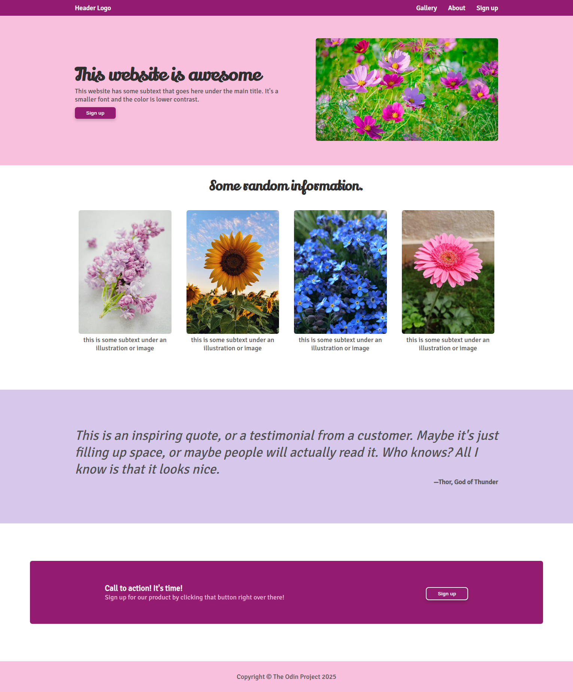

# Odin Project Landing Page

## Description

This is a ficticious landing page I made as the final exercise of the Odin Project Foundations Course. The goal of this project was to practice building responsive websites using HTML and CSS (Flexbox).

## Screenshots

## Built with

This web page was built with the following tools:

* HTML: Markup language
* CSS: Style sheet language

## Credits

This site was developed by [Andrea Olivos B](https://github.com/aolivos15).

The images used in this project are from [Unsplash](https://unsplash.com/)
